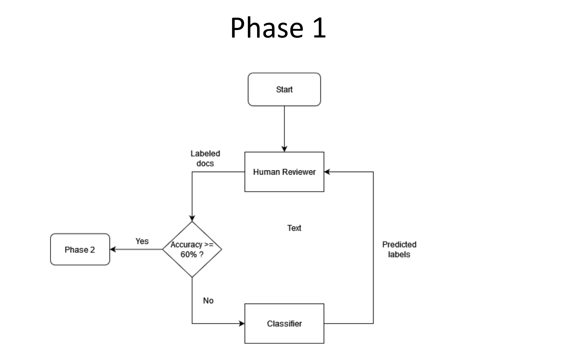
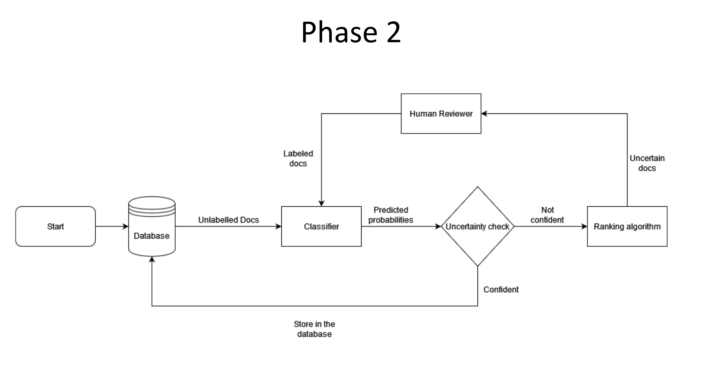
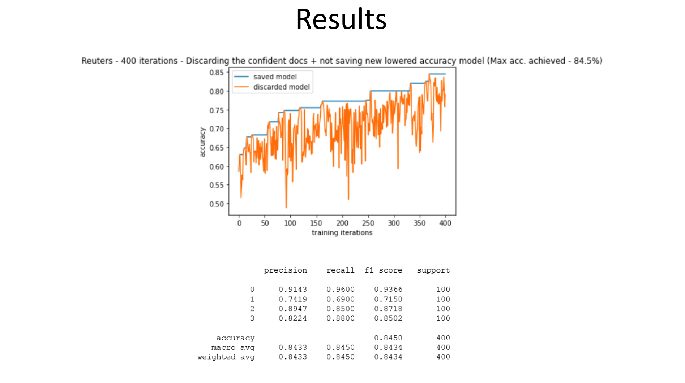
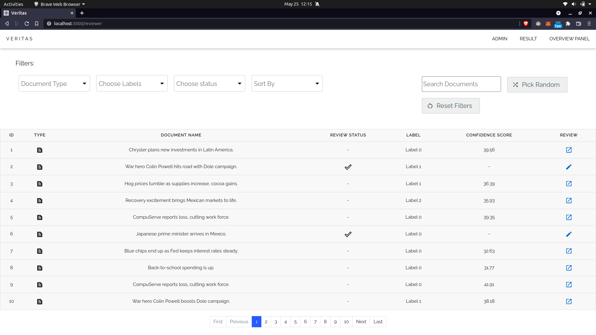
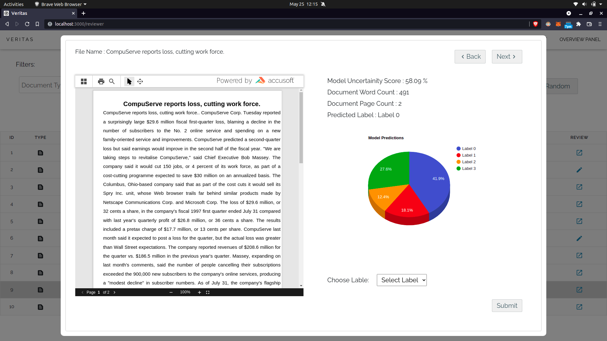
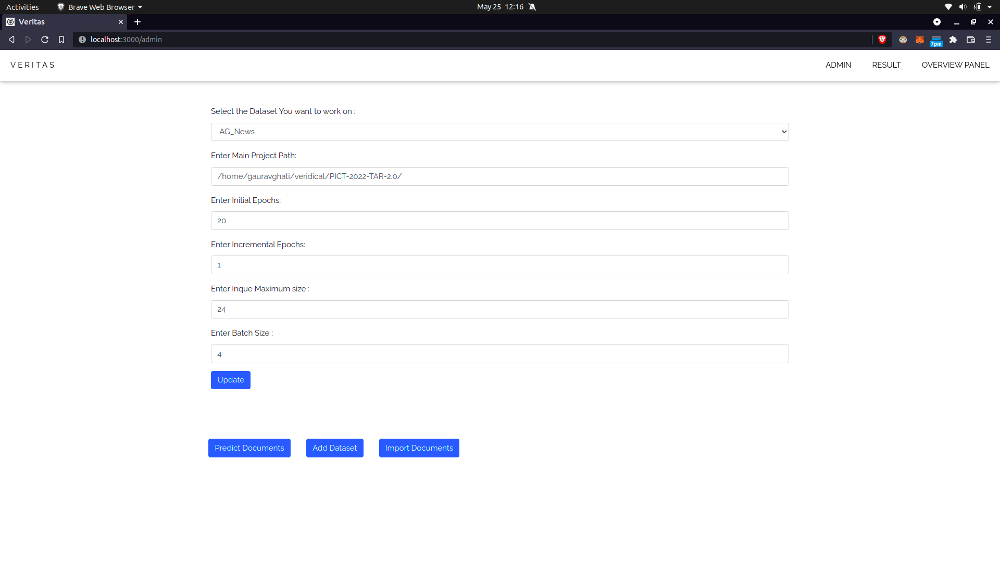
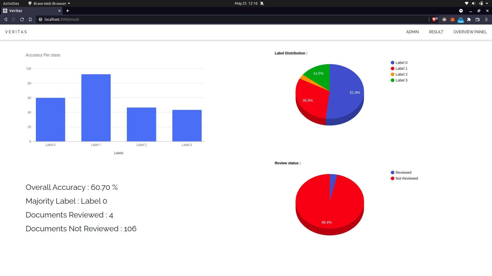

# Technology Assisted Review

Technology Assisted Review (TAR) is a methodology which is helpful to review documents and assess the similarity of documents. People in the legal department have to review a lot of documents. Manual review is very time consuming and is error-prone and full of biases. In this project we develop a methodology where we employ a ranking algorithm that would rank the document according to the most uncertain score. This will help the human reviewer to only label the documents which are most helpful to the model, thus increasing the accuracy. We use BERT and a layer of Bi-LSTM to classify the documents. During the incremental learning we use the help of pseudo rehearsal to incrementally train the model on one single datapoint and avoid the problem of catastrophic forgetting.

## 1) PROBLEM STATEMENT AND ITS SOLUTION

Review of documents is a very ubiquitous work when it comes to areas like corporate, university, banking, etc. The most common practice that occurs everywhere is reviewing the documents manually. Mistakes are bound to happen while doing this since they are an inevitable part of every process. Common reasons could be inexperienced staff, overdoing the task, inability to distinguish based on significant differences among near similar documents. Issues like bias redundancy, and many more will be introduced on varying levels. The second most important reason is the amount of effort that is invested in this job is too high. 

Our work aims to reduce the issues faced during manual reviews and lower the efforts to a large extent by providing an intelligent technology assistant to assist the reviewer in reviewing the documents.

## 2) OVERVIEW

Continuous active learning is one of the most important processes in the software development life cycle, accounting for around half of the project's time and expenditure. This guarantees that the systemperforms as expected in every circumstance. Currently, documents are reviewed manually on a large scale. Because not all reviewers have prior knowledge about the issues involved, it will be very ideal to build an intelligent model that will help these people in reviewing. As a result, an automated intelligent classifier is required to help reduce manual costs of reviewing and ranking the documents. TAR 1.0 is useful only when there is an availability of a large number of documents and it takes a lot of time to train and test, whereas our method requires very less number of documents and is much faster.

[Project Demo Video](https://drive.google.com/file/d/1ukiEyoveQA-FyfKZjX_3UtXfG5fcWIcO/view?usp=sharing)

[Project Explaination PPT](https://drive.google.com/file/d/1ic01gXrf4ERfwaaC-yHNXgkiAo2yCNSk/view?usp=sharing)

## 3) IMPLEMENTATION AND BASIC METHODOLOGY

The goal of a Technology assisted review is that the documents will get reviewed by the Machine learning algorithm, initially it starts with the labeled data, then we are using continuous active learning for actively learning the reviewing process from the manual review or the oracle. The continuous active learning (CAL) model improves the efficiency of the model significantly. The manual reviewer will be labeling data from unlabeled data to labeled data, and training the model again and again on the labeled text, with each iteration the models efficiency will increase. For processing the natural language we will be using Bi-LSTM with the BERT model.

#### Phase 1 ( Initial Learning )

#### Phase 2 ( Incremental Learning or Continuous Active Learning )

#### Results of Reuters Dataset

## 4) INSTALLATION AND SETTING UP LOCAL SERVER

For completly running the project, We'll need to install both backend and fronend servers.

For backend Installation Guide is Given here : [Backend Installtion README.md file](backend/README.md)

And for frontend it's here : [Frontend Installation README.md file](frontend/README.md)

## 5) WEB INTERFACE

A video containing all the functionalities and details of the project.
=> DRIVE LINK

#### Overview Panel

#### Reviewer Page

#### Admin Page

#### Result Page

## 6) TECH STACK AND LIBRARIES USED

#### Django : Django is a high-level Python web framework that encourages rapid development and clean, pragmatic design. Built by experienced developers, it takes care of much of the hassle of web development. It’s free and open source.

#### ReactJS : React is a free and open-source front-end JavaScript library for building user interfaces based on UI components. It is maintained by Meta and a community of individual developers and companies.

#### TensorFlow : TensorFlow is an end-to-end open source platform for machine learning. It has a comprehensive, flexible ecosystem of tools, libraries and community resources that lets researchers push the state-of-the-art in ML and developers easily build and deploy ML powered applications.

#### Pandas : Pandas is a Python library for data analysis. It's powerful and flexible quantitative analysis tool, pandas has grown into one of the most popular Python libraries. It has an extremely active community of contributors.

## 7) Benefits and Applications of Our Project:
1) TAR helps firms stay competitive.
2) TAR usage decreases overall document review costs.
3) TAR solutions enhance organization of information.
4) TAR provides early access to key information. 
5) Technology-assisted review can provide early case resolution.
